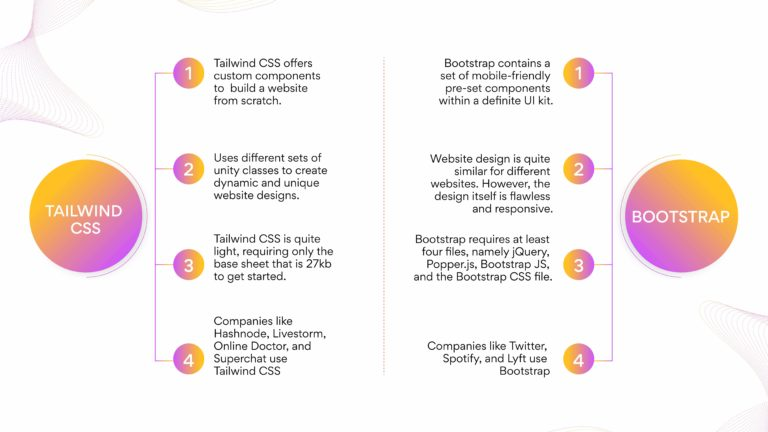

What is Tailwind CSS?

Qua. What is Tailwind CSS ?

Ans. => Tailwind CSS is a highly customizable, low-level CSS framework that allows you to custom-build designs eliminating pre-built component styles that you would anyway want to override.

Beautiful custom user interfaces can be effectively built using Tailwind CSS without much coding effort. Being a utility-first framework, Tailwind CSS enables styling every component distinctively, the way you desire.

The utility class adapts the form follow function to predict the function of each class, facilitating ease of designing. Tailwind leverages and customizes the most critical CSS properties according to project requirements .

Qua. What makes Tailwind an interesting choice among other CSS frameworks?
 ?

 
Ans. => Tailwind is different from most frameworks as developers must create components. For example, Bootstrap offers components like navigation bars, buttons, etc., for design patterns, but with Tailwind, you have to build all that yourself. Also, in Tailwind, you control the flow of everything.

In most other frameworks, all you need to know is what component will be built when you use a class name. In Tailwind, developers must have in-depth knowledge of CSS and know how to combine utility classes with vanilla CSS.

Tailwind CSS does not load all the classes at once. The framework loads classes from the CDN as and when necessary, according to the user’s movement on the website. The entire framework is not part of your final website; only the useful parts are.

Tailwind CSS gives you utility classes for each function. For example, if you want padding or a shadow, you have different classes that you can choose from. In native CSS while adding padding or shadow, there is a lot of follow-up work which is not the case in Tailwind CSS. .

Qua. What is the learning curve for Tailwind CSS?
 ?

 
Ans. => 
 The learning curve for Tailwind CSS is quite reasonable for developers who know CSS well. Developers can log on to play.tailwindcss.com to instantly get a flash editor to try out different ideas. Developers can log on to tailwind.config.js to define a JSON of all the configurations and combine multiple classes and variables. Also, installing JavaScript is not necessary to install and run Tailwind CSS. .

 
Qua. What are the key differences between Tailwind CSS and Bootstrap?
 ?

 
Ans. => 
 
 

Qua. What are some of the limitations of Tailwind CSS?
 ?

Ans. => Some of the limitations of Tailwind CSS are:  

1. The markup can look disorganized for large projects because all the styles are in the HTML files.

2. Everything must be built from scratch, including your input elements. Also, when you install Tailwind CSS,
3.  it removes all default CSS styles.

Qua. What improvements or changes have been made in the latest version

Ans. => 
Tailwind CSS v3.0 is a major upgrade with some really cool features.

Scroll Snap API – Scroll Snap API allows developers to add simple scroll snapping elements directly into the HTML for a user to scroll the page. 

Play CDN – Play CDN helps include Tailwind CSS in your projects without downloading the complete package via NPM or Yarn. This is not a CSS-based CDN. Instead, it is a script-based CDN. Add it to the head of your HTML file, and start using Tailwind’s utility classes to style your content.

RTL and LTR modifiers – RTL and LTR modifiers in Tailwind CSS v3.0 provide support for multi-directional layouts that allow developers to move objects from right to left and left to right.  

Stable Just-in-Time Engine – Tailwind CSS v3.0 comes with a stable JIT (Just-In-Time) engine. JIT engine runs in the place of the previous classic engine. The benefits of this update are as follows:

Incredibly fast build times.
Enabling all out-of-the-box variants
Generate arbitrary styles without writing custom CSS.
Better browser performance
Fancy underline styles – Change the color, style, thickness, and offset of the underlines.

Colored box shadows – Add glow, reflection effects, and more natural shadows on the colored backgrounds.

Portrait and landscape modifiers – Portrait and landscape modifiers help users view the website as per the device orientation. 

Every color out of the box – The Tailwind v3.0 enables every single color in the color palette by default.

Arbitrary properties – The arbitrary properties allow adding customized CSS, which you can combine with modifiers like hover, LG, and many more. For instance, if you want to use a CSS property that Tailwind doesn’t provide as a utility out of the box, you can use the “square bracket notation” to write completely arbitrary CSS.

Multi-column layout – The multi-column layout allows controlling the number of columns within an element.

Print modifier – The print modifier allows you to control how your webpage should look when someone prints it. The print modifier can conditionally apply styles that only come into effect when the page is printed.

Modern aspect ratio API – The modern aspect ratio API allows controlling the aspect ratio of an element. The aspect-{ratio} utilities help developers to set the preferred aspect ratio for an element.

Native form control styling – The native form control styling allows you to make checkboxes, radio buttons and file inputs match your brand identity. The support for the brand-new accent-color property and the modifier for styling file input buttons are available in the latest version making it easier to put custom designs on the native form controls.

cheetsheet links
1. [nerdcave cheetsheet link](https://nerdcave.com/tailwind-cheat-sheet)
2. [tailwind component](https://tailwindcomponents.com/cheatsheet/)
3. [flowbite](https://flowbite.com/tools/tailwind-cheat-sheet/)
4. [umesh kadam](https://umeshmk.github.io/Tailwindcss-cheatsheet/)

